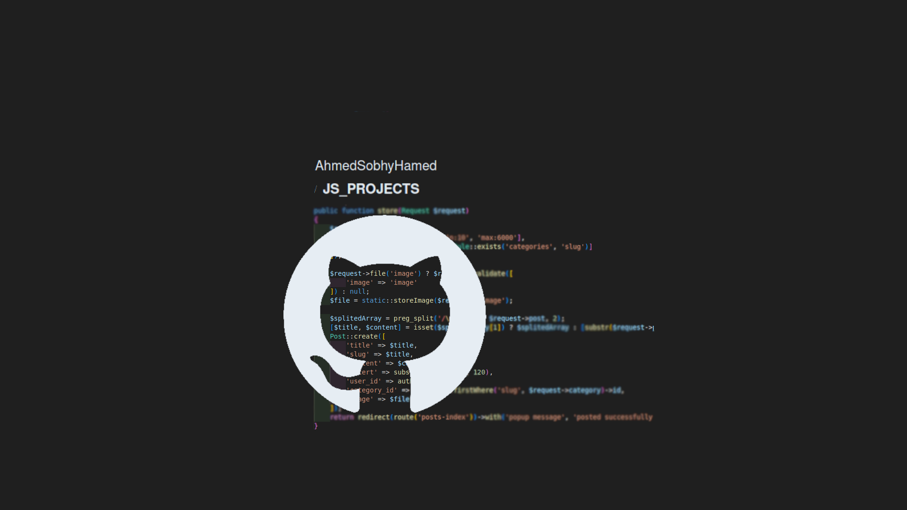

# HTML_CSS_PROJECTS

Tow small projects that is such a practicing during learning JS.

## Table of Contents

- [Introduction](#introduction)
- [Usage](#usage)
- [Technologies Used](#technologies-used)
- [Project Structure](#project-structure)
- [License](#license)
- [Contact](#contact)

  <!-- intro -->

## Introduction

This project demonstrats some JS futures.

#### First project.

a page that have atow input fields, one for adding text as a badge and, other for removing it.

#### Second project.

a note project that store the typed text in the browser storage.

**I added a small file in the root dirctory to refer to every project.**

  <!-- usage or how to interact with this technologies like api end points and what they do -->

## Usage

**You can interact with the project via this link**
[web page on github](https://ahmedsobhyhamed.github.io/JS_PROJECTS/).
 
**[see an example for user interaction.[video]](http://youtube.com)**

## Technologies Used

- HTML 5.
- CSS.
- JavaScript.

  <!-- about the project and a digram of how it work -->

## Project Structure

- add-remove-elements project:

  - css (css/style.css)
  - js (js/script.js)
  - index.html

- NotePad project:

  - css (css/style.css)
  - js (js/script.js)
  - index.html

    <!-- licance -->

## License

This project is licensed under the MIT License - see the [LICENSE](/LICENSE) file for details

  <!-- contacts -->

## Contact

Created by [Ahmed Sobhy]:

- email: [ahmed.s.abdulaal@gmail.com](mailto:ahmed.s.abdulaal@gmail.com)
- linkedin: [Ahmed Sobhy](https://www.linkedin.com/in/ahmed-sobhy-b824b7201/)
   
  feel free to contact me!
